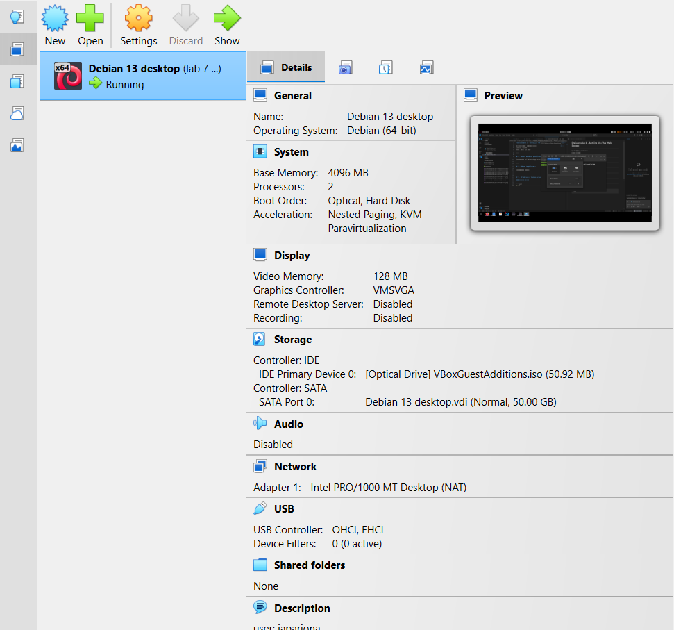
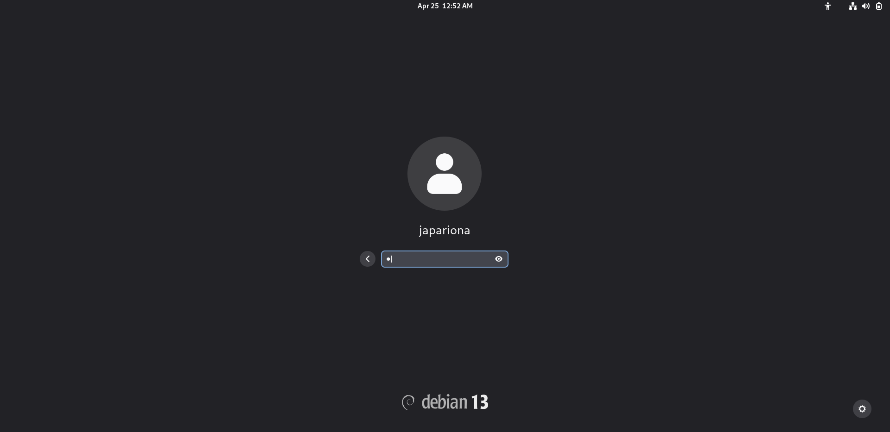
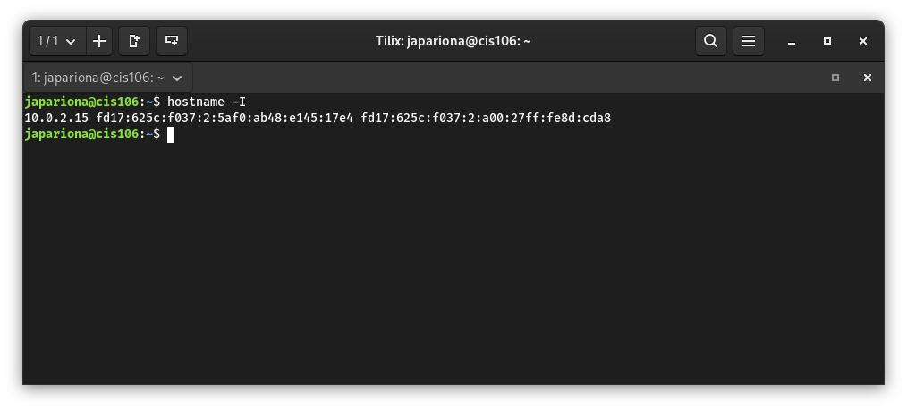
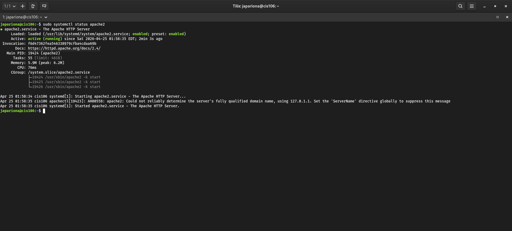
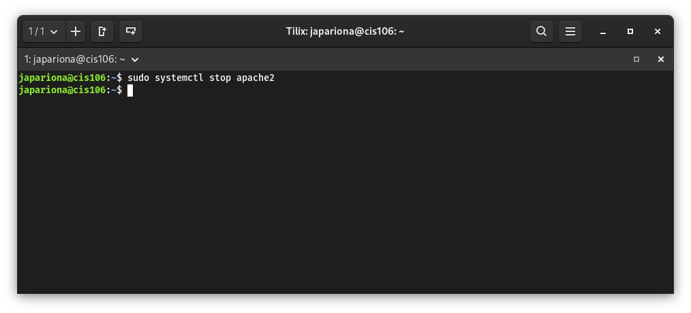
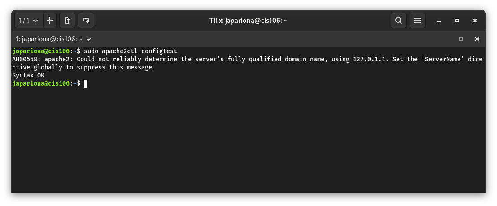
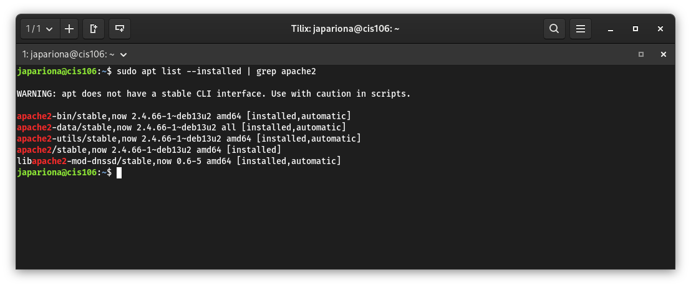
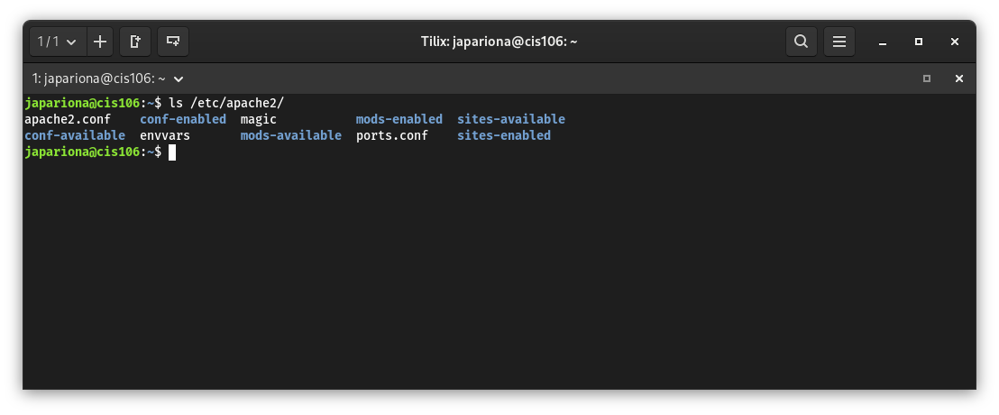
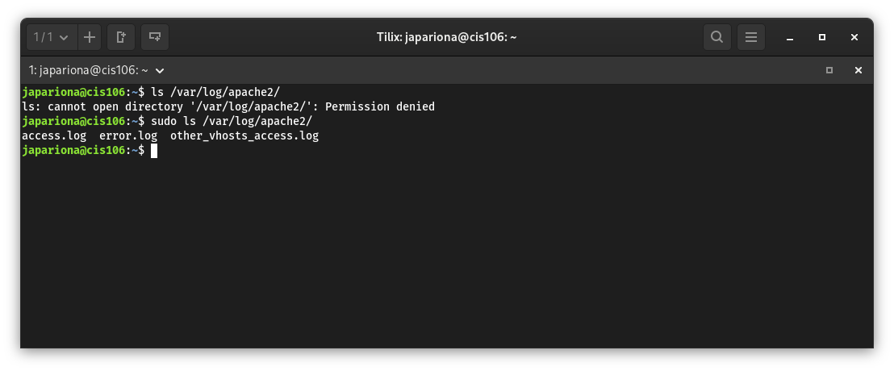
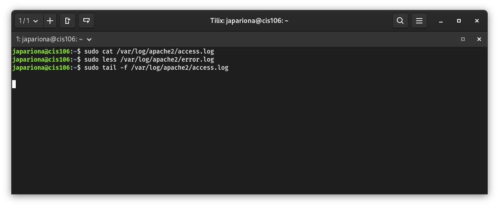

# Deliverable 2 - Setting Up The Web Server

Student Name: Jake Pariona  
Course: CIS106  
Date: April 25 2026

---

## 1. Server Hardware Specifications

---

## 2. Debian Login Screen

---

## 3. IP Address of Debian Server

### Command Used
`hostname -I`
## 4. How do you work with the Firewall in Debian? (Type and explain what each command does)

### a. How do you check if the Firewall is running?

This command checks the current status of UFW (Uncomplicated Firewall). It lets me know if the firewall is active, inactive, and can also show the rules that are currently applied to the system. This is useful to verify if my server protection is on.

`sudo ufw status`

### b. How do you disable the Firewall?

This command disables the firewall and stops it from filtering incoming or outgoing traffic. I would normally use this for testing, troubleshooting connection problems, or if I need to temporarily turn it off.

`sudo ufw disable`

### c. How do you add Apache to the Firewall?

This command creates a rule that allows Apache web server traffic through the firewall. It opens the needed web ports so users can access the hosted website from a browser.

`sudo ufw allow 'Apache'`

---

## 5. What different commands do we use to work with Apache?

### 1. What is the command you use to check if Apache is running?

This command checks the current status of the Apache service. It shows if Apache is active, running, stopped, or if there are any recent service messages. This is one of the main commands I would use to make sure the web server is working properly.

- The command is: `sudo systemctl status apache2`

### 2. What is the command you use to stop Apache?

This command stops the Apache web server service completely. I would use this if I need to restart it later, make changes safely, or shut the web server down for maintenance.

- The command is: `sudo systemctl stop apache2`

### 3. What is the command you use to start Apache?

This command starts the Apache web server service. If Apache was stopped or the server was rebooted, this command brings the service back online so the website can be accessed again.

- The command is: `sudo systemctl start apache2`

### 4. What is the command used to test Apache configuration?

This command checks Apache configuration files for syntax errors or mistakes before restarting the service. It helps prevent bad configuration changes from breaking the web server.

- The command is: `sudo apache2ctl configtest`

### 5. What is the command used to check the installed version of Apache?

This command searches installed packages related to Apache and shows the installed version number. It is useful when confirming what version is currently running on the system.

- The command is: `sudo apt list --installed | grep apache2`

### 6. What are some common configuration files for Apache?

This command lists the Apache configuration directory. Inside this folder are common files such as the main config file, virtual host files, ports configuration, and enabled modules.

- The command is: `ls /etc/apache2/`

### 7. Where does Apache store logs?

This command opens the Apache log directory. This is where Apache stores important files like access logs and error logs, which help track visitors and troubleshoot problems.

- The command is: `ls /var/log/apache2/`

### 8. What are some basic commands we can use to review logs?

These commands are used to read and monitor Apache logs. They help me check website activity, view errors, and watch new log entries in real time while testing.

- The command is: `cat /var/log/apache2/access.log`
- The command is: `less /var/log/apache2/error.log`
- The command is: `tail -f /var/log/apache2/access.log`

