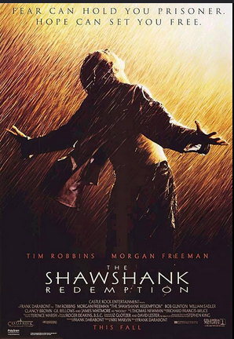
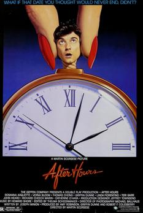

# Movies Worth Your Time

Welcome to my movie site. These are movies I personally think are worth watching. I kept it simple and organized so it’s easy to read.

---

## Top Picks

### The Shawshank Redemption

This is one of the best movies ever. The story is deep, emotional, and very motivating. It shows patience, hope, and never giving up.

---

### Terminator 2: Judgment Day

This movie is perfect if you want action. The story, visuals, and pacing are all top tier. It’s one of those movies that never gets boring.

---

### After Hours

This is a weird but really entertaining movie. It’s fast, stressful, and funny at the same time. Perfect short runtime too.

---

## Movies by Mood

- **If you want motivation:** Shawshank Redemption  
- **If you want action:** Terminator 2  
- **If you want something different:** After Hours  

---

## Ratings Table

| Movie | Runtime | Genre | My Rating |
|------|--------|------|-----------|
| Shawshank Redemption | 142 min | Drama | 5/5 |
| Terminator 2 | 137 min | Action/Sci-Fi | 5/5 |
| After Hours | 97 min | Dark Comedy | 4.5/5 |