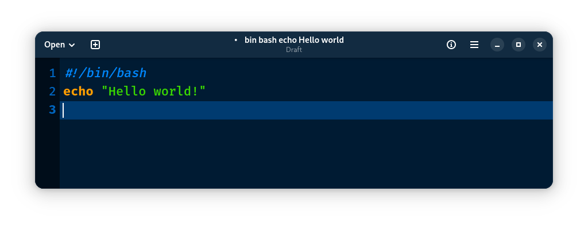
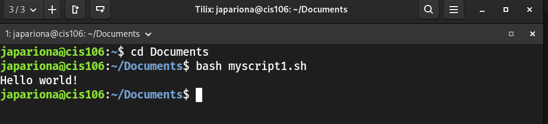

## Notes 4

## How to install and remove software using the APT command?
To install software, you use "sudo apt install package-name". If you want to completely remove the program and its configuration files, you can use "sudo apt purge package-name". You can also run "sudo apt update" to refresh the package list.

## How to create a shell script step by step including screenshots and how to run it. Try to be as detailed as possible.
To create a shell script step by step, first open a text editor. Then type the script.

The first line, #!/bin/bash, tells Linux to run the script using bash. The second line prints the message to the screen.

Next, save the file with a .sh extension, such as:

After saving it, open the terminal and go to the folder where the script was saved by using the cd command. Then run the script using the bash command:

This tells the system to execute the script using Bash. When the script runs, it will display the message written in the script. 